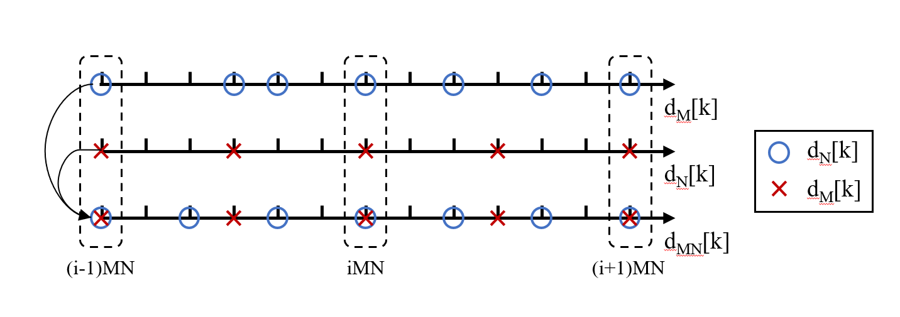
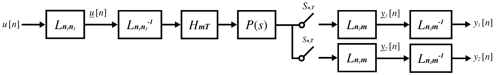
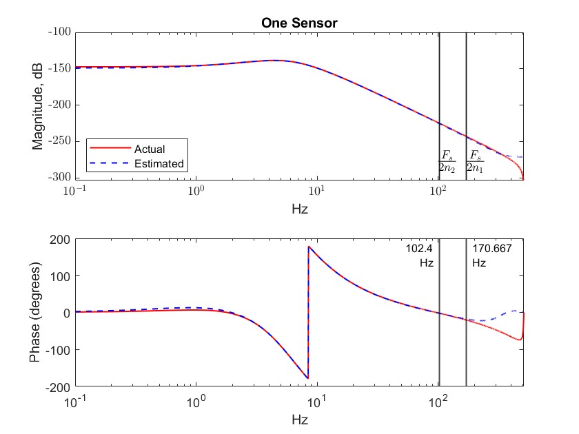
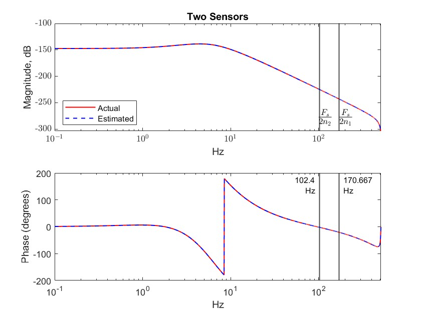
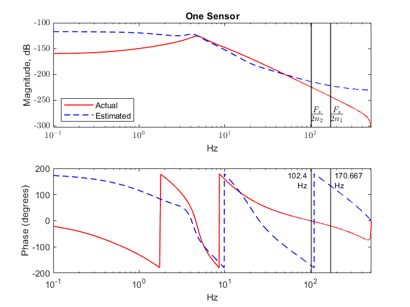
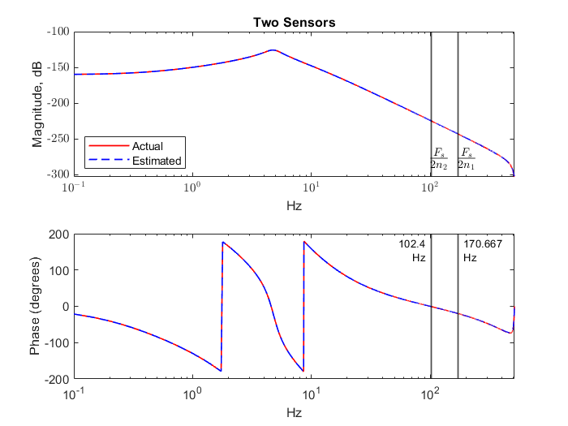

# Coprime Collaborative Sensing for System Identification

State-space system identification **beyond the Nyquist frequency** using collaborative non-uniform sensing with coprime downsampling factors.

> X. Hu, T. L. Chu, and X. Chen, "State-Space System Identification beyond the Nyquist Frequency with Collaborative Non-Uniform Sensing Data," *American Control Conference (ACC)*, 2024.

---

## How It Works

Two slow sensors with coprime downsampling factors `n1` and `n2` (where `gcd(n1,n2) = 1`) collaboratively identify system dynamics **beyond their individual Nyquist frequencies**.

The non-uniform sampling pattern created by coprime factors produces a combined data stream equivalent to a much faster effective rate:

<p align="center">
  
</p>

The multirate system is modeled using a **lifting transformation** that converts the problem into a single-rate framework amenable to standard subspace identification:

<p align="center">
  
</p>

**Algorithm pipeline:**

1. **Lifting** -- reshape multirate sensor data into a single-rate lifted system
2. **N4SID** -- subspace identification on the lifted data (with automatic order selection)
3. **Recovery** -- extract the fast single-rate model via eigenvalue decomposition of the lifted system matrices

---

## Results

### One sensor fails beyond its Nyquist limit

A single slow sensor (sampling at period `n1*T`) cannot identify dynamics above its Nyquist frequency `Fs/(2*n1)`. The estimated Bode plot diverges from the true system:

<p align="center">
  
</p>

### Two coprime sensors succeed

Two sensors with coprime factors (`n1=3`, `n2=5`) collaboratively identify the system accurately up to `Fs/(2*m)`, well beyond either sensor's individual Nyquist limit:

<p align="center">
  
</p>

### Non-minimum-phase system validation

The algorithm also works on higher-order non-minimum-phase systems. One sensor fails (left), two coprime sensors succeed (right):

<p align="center">
  
  
</p>

---

## Repository Structure

```
coprime_sensing_sys_id/
├── setup_paths.m                            # Run first: adds folders to path
│
├── src/                                     # Core algorithm
│   ├── n4sidkatamodar_TC.m                  #   Modified N4SID (auto order)
│   ├── blkhank.m                            #   Block Hankel matrix builder
│   └── create_prbs.m                        #   PRBS signal generator
│
├── examples/                                # Runnable demos
│   ├── validate_camera_ready_testn2.m       #   Paper figs: 1-sensor vs 2-sensor
│   ├── validate_order_nmp.m                 #   Non-minimum-phase validation
│   ├── models_multirate_data_example_2022b.slx   # Simulink model (NMP demo)
│   └── models_multirate_data_example_2022b2.slx  # Simulink model (paper demo)
│
└── images/                                  # Figures for README
```

---

## Quick Start

Requires **MATLAB R2022b+** with **Simulink**.

### 1. Setup paths

```matlab
>> setup_paths
```

### 2. Paper demo: one sensor vs two sensors

```matlab
>> validate_camera_ready_testn2
```

Generates Bode plots comparing a single slow sensor (fails beyond Nyquist) with two coprime sensors (succeeds).

### 3. Non-minimum-phase system validation

```matlab
>> validate_order_nmp
```

Tests the algorithm on an order-8 NMP system with random poles and non-minimum-phase zeros.

---

## Citation

```bibtex
@inproceedings{hu2024coprime,
  title     = {State-Space System Identification beyond the Nyquist Frequency
               with Collaborative Non-Uniform Sensing Data},
  author    = {Hu, Xiaohai and Chu, Thomas L. and Chen, Xu},
  booktitle = {American Control Conference (ACC)},
  year      = {2024}
}
```

## Authors

Bob Xiaohai Hu, Thomas Chu, Xu Chen -- University of Washington, Mechanical Engineering

## License

MIT -- see [LICENSE](LICENSE).
